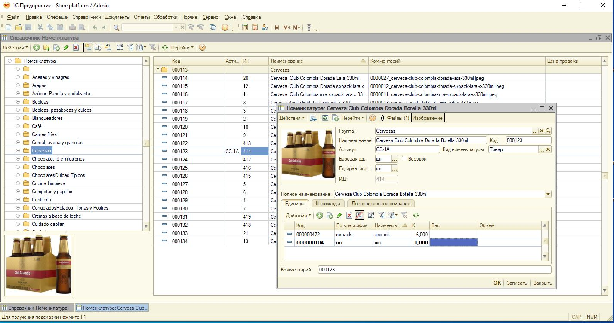
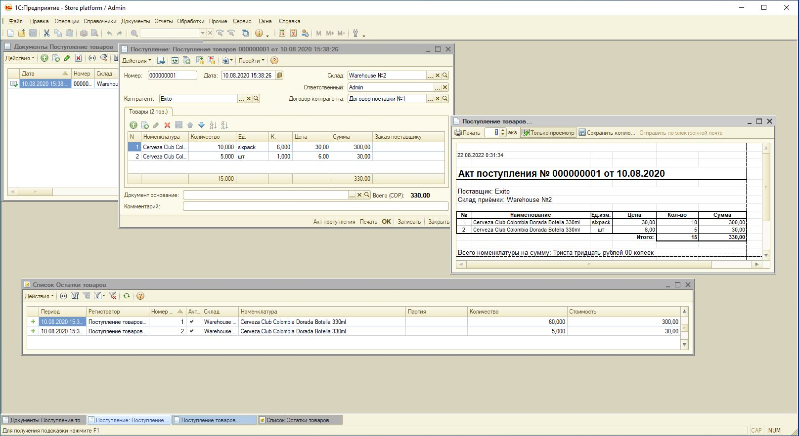
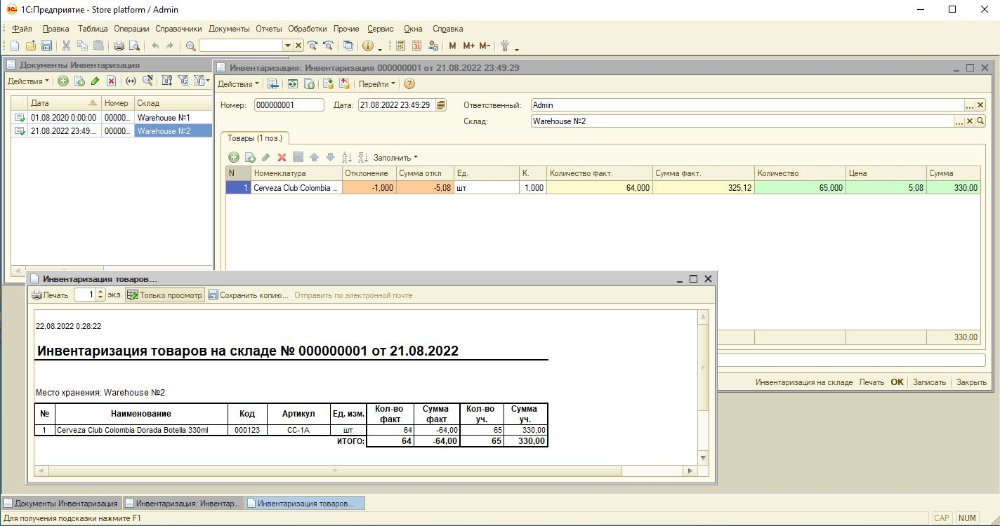
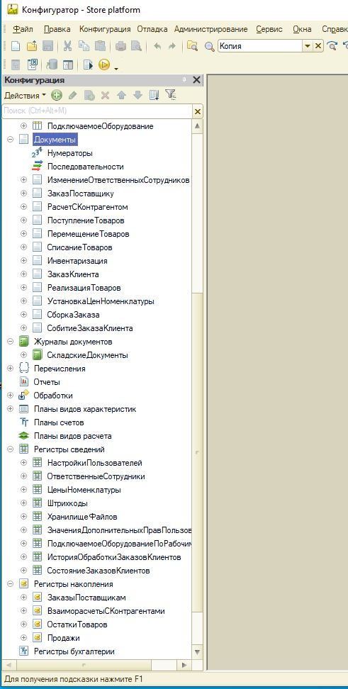

# mvp_StorePlatform
Простая товароучетная программа на базе платформы 1С:Предприятие 8, предназначенная для автоматизации торговой деятельности небольших организаций.

## Функционал
- Работа с номенклатурой, включая хранение изображений, учет в нескольких единицах измерения, ведение учета по характеристикам и c использованием штрихкодов
- Основные складские операции: приемка, списание, реализация, перемещение и инвентаризация
- Взаимодействие с контрагентами, включая оформление заказов и ведение взаиморасчетов
- Ценообразование с настройкой типов цен и установкой цен
- Учет продаж с соответствующими регистрами и отчетами
- Учет себестоимости остатков по "ФИФО" и/или по "среднему"(на регистре остатков) 
- Отсутствует привязка к аспектам ведения учета в соответствии с требованиями РФ
- В программе имеется простая ролевая модель(Администратор, Товаровед, Менеджер ассортимента, Менеджер ценообразования, КРО, Сборщик заказов, Только просмотр)
- Частичный перевод интерфейса на английский язык
- Имеется возможность подключения сканера штрихкодов, но прикладная логика обработки сигналов сканера - не реализована

## Особенности
- Программа писалась в 2019 году, как учётная система Интернет-сервиса по доставке продуктов питания
- Используются технологии обычных форм 1С:Предприятие
- Часть логики и функционала базируется на механиках конфигурации УТ10.3
- При необходимости использования в реальных проектах, конфигурацию можно(и нужно) соответствующим образом доработать
- Конфигурация может быть использована в качестве серверной части (backend) для интернет-магазина

## Todo
- Доделать работу со сканером ШК
- Доделать функционал установки цен и переоценки
- Ценообразование(доделать механики использования нескольких типов цен, периодичность)
- Реализовать функционал резервирования товаров(под заказ покупателя + новый регистр)
- Номенклатура(добавить отображение части параметров на форме списка и форме выбора, в частности остатков и резервов)
- Клиент-серверные нюансы взаимодействия
- Курсы валют, обновление курсов
- Создать интерфейсы(панель функций)
- Акции и скидки
- Добавить документ "Передача заказов на доставку"
- Возможность использования(интеграция) ТСД
- Продумать использование RLS
- Документы возврата поставщику и возврата от покупателя
- Инструмент управления содержимым лендинговой страницы
- Последовательность, восстановление последовательности
- Документ корректировки регистров

## Скриншоты

